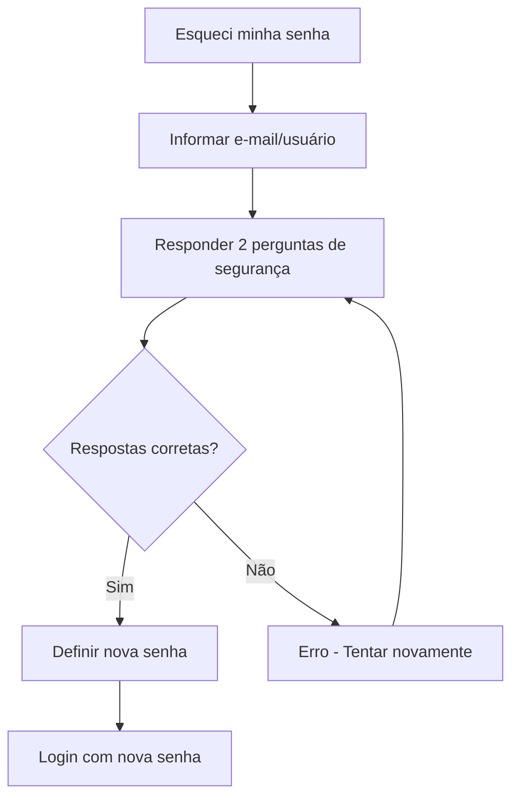

# 🚗 Sistema de Agendamento de Veículos

Sistema completo de gerenciamento de agendamentos de veículos desenvolvido com **Django 5.2** e **Python 3.12**, com controle de quilometragem, trajetos, sistema de aprovação e exportação de relatórios em PDF e Excel.


[](https://opensource.org/licenses/Apache-2.0)
[](https://www.djangoproject.com/)
[](https://www.python.org/)

## 📖 Sobre o Projeto

O **Sistema de Agendamento de Veículos** é uma solução web completa e profissional para gerenciamento de solicitações, aprovações e controle de uso de veículos institucionais. Desenvolvido especificamente para instituições de ensino, o sistema oferece controle granular sobre agendamentos, trajetos, quilometragem e relatórios detalhados.

### 🎯 Principais Objetivos

- **Centralizar** a gestão de agendamentos de veículos
- **Automatizar** processos de solicitação e aprovação
- **Controlar** limites de quilometragem por curso/departamento
- **Monitorar** uso de veículos em tempo real
- **Gerar** relatórios profissionais para análise e auditoria
- **Prevenir** conflitos de horários e uso inadequado

### 💡 Por que usar este sistema?

✅ **Interface Intuitiva** - Fácil de usar para professores e administradores  
✅ **Controle Total** - Aprovação centralizada e rastreamento completo  
✅ **Economia** - Monitore e controle gastos com combustível  
✅ **Relatórios Profissionais** - PDF e Excel para análise e auditoria  
✅ **Segurança** - Autenticação robusta e recuperação de senha  
✅ **Escalável** - Pronto para crescer com sua instituição  
✅ **Moderno** - Tecnologias atuais e melhores práticas  
✅ **Open Source** - Código aberto e customizável

## 📋 Sumário

- [� Sobre o Projeto](#-sobre-o-projeto)
- [�🚀 Início Rápido](#-início-rápido)
  - [🐳 Com Docker (Recomendado)](#-com-docker-recomendado)
  - [⚡ Com Scripts de Automação](#-com-scripts-de-automação)
  - [🛠️ Instalação Manual](#%EF%B8%8F-instalação-manual)
- [🏗️ Arquitetura](#%EF%B8%8F-arquitetura)
- [✨ Funcionalidades](#-funcionalidades)
- [🛠️ Tecnologias](#%EF%B8%8F-tecnologias)
- [📦 Instalação](#-instalação)
- [🔧 Configuração Básica](#-configuração-básica)
- [🐳 Docker](#-docker)
- [⚡ Scripts de Automação](#-scripts-de-automação)
- [📊 Exportação de Relatórios](#-exportação-de-relatórios)
- [🏃‍♂️ Comandos Úteis](#%EF%B8%8F-comandos-úteis)
- [📖 Uso do Sistema](#-uso-do-sistema)
- [🔒 Sistema de Autenticação](#-sistema-de-autenticação)
- [📁 Estrutura do Projeto](#-estrutura-do-projeto)
- [🗄️ Modelos de Dados](#%EF%B8%8F-modelos-de-dados)
- [🧪 Testes](#-testes)
- [❓ FAQ](#-faq)
- [👤 Autor](#-autor)
- [🤝 Contribuição](#-contribuição)
- [📜 Licença](#-licença)

## 🚀 Início Rápido

### 🐳 Com Docker (Recomendado)

```bash
# Clone o projeto
git clone https://github.com/HeitorLouzeiro/agendamento_veiculos.git
cd agendamento_veiculos

# Configure as variáveis de ambiente
cp .env.example .env

# Setup completo com Docker
docker-setup.bat  # Windows
# ou
./docker-setup.sh  # Linux/Mac

# Iniciar aplicação
docker-compose up
```

**Ou manualmente com Docker:**
```bash
# Construir e iniciar serviços
docker-compose build
docker-compose up -d db
docker-compose run --rm web python manage.py migrate
docker-compose run --rm web python manage.py createsuperuser
docker-compose up
```

### ⚡ Com Scripts de Automação

```bash
# Clone o projeto
git clone https://github.com/HeitorLouzeiro/agendamento_veiculos.git
cd agendamento_veiculos

# Setup completo automatizado
./setup.sh

# Iniciar servidor
./start.sh
```

### 🛠️ Instalação Manual

```bash
# Clone e configure manualmente
git clone https://github.com/HeitorLouzeiro/agendamento_veiculos.git
cd agendamento_veiculos
python -m venv venv

# Windows
venv\Scripts\activate
# Linux/Mac
source venv/bin/activate

# Instale dependências e configure
pip install -r requirements.txt
python manage.py migrate
python manage.py createsuperuser
python manage.py runserver
```

✅ **Acesse a aplicação:**
- **Local/Scripts:** http://127.0.0.1:8000
- **Docker:** http://localhost:8000

> 💡 **Dica:** Docker oferece maior consistência entre ambientes. Para desenvolvimento local tradicional, use os scripts de automação. Veja [DOCKER.md](DOCKER.md) e [SCRIPTS.md](SCRIPTS.md) para detalhes.

## 🏗️ Arquitetura

O sistema segue a arquitetura **MVT (Model-View-Template)** do Django:

```
┌─────────────────────────────────────────────────────────────┐
│                    Cliente (Browser)                        │
└────────────────────────┬────────────────────────────────────┘
                         │ HTTP Request/Response
┌────────────────────────▼────────────────────────────────────┐
│                    Django Framework                         │
│  ┌──────────────┐  ┌──────────────┐  ┌──────────────┐     │
│  │   URLs       │─►│    Views     │◄►│   Templates  │     │
│  │  (Routers)   │  │ (Controllers)│  │    (HTML)    │     │
│  └──────────────┘  └──────┬───────┘  └──────────────┘     │
│                            │                                 │
│                    ┌───────▼────────┐                       │
│                    │     Models     │                       │
│                    │  (ORM Layer)   │                       │
│                    └───────┬────────┘                       │
└────────────────────────────┼────────────────────────────────┘
                             │
                    ┌────────▼────────┐
                    │ SQLite/PostgreSQL│
                    │    Database      │
                    └─────────────────┘
```

### Aplicações Django

- **usuarios** - Autenticação e gestão de usuários
- **cursos** - Cadastro e controle de cursos
- **veiculos** - Gestão de veículos
- **agendamentos** - Controle de agendamentos e trajetos
- **dashboard** - Painel principal do sistema

## ✨ Funcionalidades

### 👨‍🏫 Para Professores
- ✅ Criar solicitações de agendamento de veículos
- ✅ Visualizar histórico de agendamentos próprios
- ✅ Registrar trajetos realizados com quilometragem
- ✅ Editar perfil e alterar senha
- ✅ Recuperação de senha por perguntas de segurança
- ✅ Acompanhar status das solicitações

### 👔 Para Administradores
- ✅ Aprovar ou reprovar solicitações de agendamento
- ✅ Gerenciar cadastro de veículos (CRUD completo)
- ✅ Gerenciar cadastro de cursos (CRUD completo)
- ✅ Gerenciar usuários (professores e administradores)
- ✅ Visualizar todos os agendamentos do sistema
- ✅ Monitorar uso de quilometragem por curso
- ✅ Dashboard com estatísticas e visão geral
- ✅ Controle de limite de KM mensal por curso

### 🔧 Funcionalidades do Sistema
- ✅ Sistema de autenticação por e-mail ou username
- ✅ **Ativação de conta por e-mail institucional**
- ✅ **Restrição de cadastro apenas para e-mails institucionais**
- ✅ Validação automática de conflitos de horários
- ✅ Controle de limite de KM mensal por curso
- ✅ Histórico completo de trajetos e quilometragem
- ✅ Interface responsiva para desktop e mobile
- ✅ Notificações de status de agendamento
- ✅ **Exportação de relatórios em PDF e Excel**
- ✅ **Relatórios gerais, por curso e por professor**
- ✅ Sistema de busca e filtros avançados
- ✅ Dashboard com estatísticas em tempo real
- ✅ Sistema de paginação inteligente
- ✅ Calendário visual de agendamentos

## 🛠️ Tecnologias

### Backend
- **Python** 3.12+ - Linguagem de programação
- **Django** 5.2.7 - Framework web
- **SQLite** - Banco de dados (desenvolvimento local)
- **PostgreSQL** 15 - Banco de dados (produção/Docker)
- **psycopg2-binary** - Adaptador PostgreSQL para Python
- **Django ORM** - Mapeamento objeto-relacional
- **Django Auth** - Sistema de autenticação

### Frontend
- **HTML5/CSS3** - Estrutura e estilo
- **JavaScript** - Interatividade no cliente
- **Bootstrap** 5 - Framework CSS responsivo
- **jQuery** - Biblioteca JavaScript

### Bibliotecas e Dependências
- **django-debug-toolbar** 6.0.0 - Ferramenta de debug
- **Pillow** 11.3.0 - Processamento de imagens
- **python-decouple** 3.8 - Gerenciamento de variáveis de ambiente
- **python-dotenv** 1.1.1 - Carregamento de variáveis .env
- **Faker** 37.8.0 - Geração de dados de teste
- **pytz** 2025.2 - Suporte a fusos horários
- **gunicorn** 23.0.0 - Servidor WSGI para produção
- **whitenoise** 6.11.0 - Servir arquivos estáticos em produção
- **reportlab** 4.4.4 - Geração de PDFs
- **openpyxl** 3.1.5 - Geração de planilhas Excel
- **xlsxwriter** 3.2.9 - Escrita de arquivos Excel avançados

### DevOps & Containerização
- **Docker** - Containerização da aplicação
- **Docker Compose** - Orquestração de containers
- **PostgreSQL** (Docker) - Banco de dados em container
- **WhiteNoise** - Servir arquivos estáticos em produção
- **Gunicorn** - Servidor WSGI para produção

### 🔒 Segurança
- **CSRF Protection** - Proteção contra ataques CSRF
- **SQL Injection Protection** - ORM do Django
- **XSS Protection** - Template engine seguro
- **Password Hashing** - Senhas com hash seguro (PBKDF2)
- **Perguntas de Segurança** - Sistema de recuperação de senha
- **Autenticação Customizada** - Backend de autenticação por e-mail

### ⚡ Performance
- **Database Indexing** - Índices otimizados
- **Query Optimization** - Consultas otimizadas com select_related
- **Static Files Compression** - WhiteNoise com compressão
- **Connection Pooling** - Pool de conexões PostgreSQL
- **Lazy Loading** - Carregamento sob demanda

## 📦 Instalação

### Pré-requisitos

#### Para Desenvolvimento Local
- **Python** 3.12 ou superior
- **pip** (gerenciador de pacotes Python)
- **Git** (para clonar o repositório)
- **Virtualenv** (recomendado)

#### Para Docker (Recomendado)
- **Docker** (20.10+)
- **Docker Compose** (2.0+)
- **Git** (para clonar o repositório)

### Verificação de Dependências

**Para desenvolvimento local:**
```bash
# Verificar Python
python --version

# Verificar pip
pip --version

# Verificar Git
git --version
```

**Para Docker:**
```bash
# Verificar Docker
docker --version

# Verificar Docker Compose
docker-compose --version

# Verificar Git
git --version
```

### Instalação Detalhada

#### Configuração do Ambiente Virtual

**Windows:**
```cmd
# CMD
venv\Scripts\activate

# PowerShell
venv\Scripts\Activate.ps1
```

**Linux/Mac:**
```bash
source venv/bin/activate
```

#### Dados de Exemplo (Opcional)

Execute o comando para criar dados de teste:

```bash
# Comando básico (valores padrão)
python manage.py load_sample_data

# Com parâmetros customizados
python manage.py load_sample_data --professores 15 --agendamentos 50 --administradores 5

# Para Docker
docker-compose run --rm web python manage.py load_sample_data --professores 10 --agendamentos 20
```

**Parâmetros disponíveis:**
- `--administradores` - Quantidade de administradores (padrão: 3)
- `--professores` - Quantidade de professores (padrão: 10) 
- `--agendamentos` - Quantidade de agendamentos (padrão: 30)

**O comando criará automaticamente:**
- 🔐 **Administradores** com credenciais de teste
- 👨‍🏫 **Professores** com perfis completos usando dados do Faker
- 📚 **5 cursos** diversos com limites de KM variados
- 🚗 **8 veículos** com diferentes características
- 📅 **Agendamentos** com status variados (pendente, aprovado, reprovado)
- 🗺️ **Trajetos** associados aos agendamentos aprovados
- ❓ **Perguntas de segurança** para recuperação de senha

### 👤 Usuários de Teste

Para facilitar o teste do sistema de recuperação de senha, aqui estão as credenciais e respostas de segurança dos usuários padrão:

#### **🔐 Administrador Principal**
| Campo | Valor |
|-------|-------|
| **E-mail** | `admin@sistema.com` |
| **Username** | `admin` |
| **Senha** | `admin123` |

**Perguntas de Segurança:**
| Pergunta | Resposta |
|----------|----------|
| Qual é o nome da sua mãe? | `Maria` |
| Qual é o nome do seu primeiro animal de estimação? | `Rex` |
| Em que cidade você nasceu? | `São Paulo` |

#### **👨‍🏫 Professor de Teste**
| Campo | Valor |
|-------|-------|
| **E-mail** | `professor@teste.com` |
| **Username** | `professor` |
| **Senha** | `prof123` |

**Perguntas de Segurança:**
| Pergunta | Resposta |
|----------|----------|
| Qual é o nome da sua escola primária? | `Santos Dumont` |
| Qual é seu filme favorito? | `Matrix` |
| Qual é sua comida favorita? | `Pizza` |

#### **🧪 Como Testar a Recuperação de Senha**

1. **Acesse:** `/usuarios/recuperar-senha/`
2. **Digite:** `admin@sistema.com` ou `admin`
3. **Responda:**
   - Nome da mãe: `Maria`
   - Nome do animal: `Rex` 
   - Cidade natal: `São Paulo`
4. **Defina uma nova senha** seguindo os critérios de segurança
5. **Faça login** com a nova senha

> ⚠️ **Atenção:** As respostas são **case-sensitive**. Digite exatamente como mostrado acima!

## � Configuração Básica

### 🌍 Variáveis de Ambiente

Para ambos os ambientes (local e Docker), você pode configurar:

```env
# Arquivo .env (opcional para desenvolvimento local, obrigatório para Docker)
DEBUG=True
SECRET_KEY=sua-chave-secreta-segura
ALLOWED_HOSTS=localhost,127.0.0.1

# Banco de dados (automático baseado no ambiente)
DB_ENGINE=sqlite3          # Para desenvolvimento local
# ou
DB_ENGINE=postgresql       # Para Docker/Produção

# Configuração de E-mail (OBRIGATÓRIO para ativação de contas)
EMAIL_BACKEND=django.core.mail.backends.smtp.EmailBackend
EMAIL_HOST=smtp.gmail.com
EMAIL_PORT=587
EMAIL_USE_TLS=True
EMAIL_HOST_USER=seu-email@gmail.com
EMAIL_HOST_PASSWORD=sua-senha-de-app
DEFAULT_FROM_EMAIL=noreply@uespi.br

# Domínios de E-mail Institucionais Permitidos
ALLOWED_EMAIL_DOMAINS=uespi.br,aluno.uespi.br,phb.uespi.br

# Localização
LANGUAGE_CODE=pt-br
TIME_ZONE=America/Sao_Paulo
```

### 📧 Configuração de E-mail

**Importante:** O sistema requer configuração de e-mail para ativação de contas.

#### **Opção 1: Gmail (Desenvolvimento/Teste)**

1. **Crie uma senha de aplicativo** no Gmail:
   - Acesse https://myaccount.google.com/security
   - Ative a "Verificação em duas etapas"
   - Vá em "Senhas de app"
   - Gere uma senha para "E-mail" ou "Outro"

2. **Configure no `.env`:**
```env
EMAIL_BACKEND=django.core.mail.backends.smtp.EmailBackend
EMAIL_HOST=smtp.gmail.com
EMAIL_PORT=587
EMAIL_USE_TLS=True
EMAIL_HOST_USER=seu-email@gmail.com
EMAIL_HOST_PASSWORD=xxxx-xxxx-xxxx-xxxx  # Senha de app gerada
DEFAULT_FROM_EMAIL=noreply@uespi.br
```

#### **Opção 2: Servidor SMTP Institucional (Produção)**

```env
EMAIL_BACKEND=django.core.mail.backends.smtp.EmailBackend
EMAIL_HOST=smtp.uespi.br
EMAIL_PORT=587
EMAIL_USE_TLS=True
EMAIL_HOST_USER=sistema@uespi.br
EMAIL_HOST_PASSWORD=senha-segura
DEFAULT_FROM_EMAIL=noreply@uespi.br
```

#### **Opção 3: Console (Apenas Desenvolvimento Local)**

Para desenvolvimento sem configurar e-mail real:

```env
EMAIL_BACKEND=django.core.mail.backends.console.EmailBackend
```

> ⚠️ **Atenção:** Com `console.EmailBackend`, os e-mails são exibidos no terminal, não são enviados de verdade. **Não use em produção!**

### 🏢 Domínios de E-mail Institucionais

Configure os domínios aceitos em `ALLOWED_EMAIL_DOMAINS`:

```env
# Aceitar múltiplos domínios (separados por vírgula)
ALLOWED_EMAIL_DOMAINS=uespi.br,aluno.uespi.br,phb.uespi.br,cca.uespi.br
```

**Exemplos de configuração:**
- **Apenas professores:** `ALLOWED_EMAIL_DOMAINS=uespi.br`
- **Professores e alunos:** `ALLOWED_EMAIL_DOMAINS=uespi.br,aluno.uespi.br`
- **Múltiplos campus:** `ALLOWED_EMAIL_DOMAINS=uespi.br,phb.uespi.br,cca.uespi.br`

### ⚙️ Ambientes Suportados

| Componente | Desenvolvimento Local | Docker |
|------------|----------------------|---------|
| **Python** | Instalação local | Container |
| **Banco de Dados** | SQLite | PostgreSQL |
| **Servidor** | runserver | Gunicorn |
| **Configuração** | .env (opcional) | .env (obrigatório) |

## �🐳 Docker

O projeto oferece suporte completo ao Docker para facilitar o desenvolvimento e deploy. Com Docker, você não precisa instalar Python, PostgreSQL ou outras dependências localmente.

### 🚀 Configuração Rápida

```bash
# 1. Clone o repositório
git clone https://github.com/HeitorLouzeiro/agendamento_veiculos.git
cd agendamento_veiculos

# 2. Configure variáveis de ambiente
cp .env.example .env
# Edite o .env conforme necessário

# 3. Execute setup automático
docker-setup.bat  # Windows
# ou
./docker-setup.sh  # Linux/Mac
```

### 🎯 Comandos Docker Essenciais

```bash
# Construir imagens
docker-compose build

# Iniciar em modo desenvolvimento (com live reload)
docker-compose --profile dev up

# Iniciar em modo produção
docker-compose up

# Executar em background
docker-compose up -d

# Parar serviços
docker-compose down

# Ver logs
docker-compose logs -f web
```

### 🔧 Comandos de Desenvolvimento Django

```bash
# Migrações
docker-compose run --rm web python manage.py migrate
docker-compose run --rm web python manage.py makemigrations

# Administração
docker-compose run --rm web python manage.py createsuperuser
docker-compose run --rm web python manage.py collectstatic --noinput
docker-compose run --rm web python manage.py shell

# Dados de exemplo (com parâmetros customizáveis)
docker-compose run --rm web python manage.py load_sample_data
docker-compose run --rm web python manage.py load_sample_data --professores 20 --agendamentos 100 --administradores 5

# Testes e debug
docker-compose run --rm web python manage.py test
docker-compose logs -f web                 # Ver logs da aplicação
docker-compose logs -f db                  # Ver logs do banco
docker-compose exec web bash               # Acessar container web
docker-compose exec db psql -U postgres -d agendamento_veiculos  # Acessar PostgreSQL
```

### 📋 Serviços Docker

| Serviço | Descrição | Porta | Ambiente |
|---------|-----------|-------|----------|
| **web** | Aplicação Django (Gunicorn) | 8000 | Produção |
| **web-dev** | Aplicação Django (runserver) | 8000 | Desenvolvimento |
| **db** | PostgreSQL 15 | 5432 | Ambos |

### 🔒 Variáveis de Ambiente

O arquivo `.env.example` contém todas as configurações necessárias:

```bash
# Configurações básicas
DEBUG=True
SECRET_KEY=sua-chave-secreta
ALLOWED_HOSTS=localhost,127.0.0.1

# Banco de dados PostgreSQL
DB_ENGINE=postgresql
DB_NAME=agendamento_veiculos
DB_USER=postgres
DB_PASSWORD=postgres
DB_HOST=localhost  # 'db' no Docker
DB_PORT=5432

# Localização
LANGUAGE_CODE=pt-br
TIME_ZONE=America/Sao_Paulo
```

### 📊 Backup e Restore

```bash
# Backup do banco PostgreSQL
docker-compose exec db pg_dump -U postgres agendamento_veiculos > backup.sql

# Restore do banco
docker-compose exec -T db psql -U postgres agendamento_veiculos < backup.sql
```

### 🔍 Troubleshooting Docker

```bash
# Limpar containers e volumes
docker-compose down -v

# Reconstruir sem cache
docker-compose build --no-cache

# Ver status dos containers
docker-compose ps

# Acessar container em execução
docker-compose exec web bash
docker-compose exec db psql -U postgres -d agendamento_veiculos
```

> 📖 **Documentação Completa:** Veja [DOCKER.md](DOCKER.md) para guia detalhado de uso do Docker.

## ⚡ Scripts de Automação

O projeto inclui scripts shell para automatizar tarefas comuns de desenvolvimento:

### 🎯 Scripts Principais

```bash
# Setup inicial completo (execute uma vez)
./setup.sh

# Iniciar servidor com verificações completas
./start.sh

# Desenvolvimento rápido (minimalista)
./dev.sh

# Reset completo do banco de dados
./reset.sh
```

### 📋 Funcionalidades dos Scripts

| Script | Funcionalidade | Uso |
|--------|---------------|-----|
| **setup.sh** | Configuração inicial completa | Primeira vez ou nova máquina |
| **start.sh** | Servidor com verificações | Desenvolvimento diário |
| **dev.sh** | Servidor rápido | Quando precisa de velocidade |
| **reset.sh** | Reset do banco | Quando quer começar do zero |

### 🎨 Características

- ✅ **Interface colorida** e informativa
- ✅ **Verificações automáticas** de ambiente
- ✅ **Detecção de porta** disponível (8000-8005)
- ✅ **Criação automática** de venv se necessário
- ✅ **Tratamento de erros** robusto
- ✅ **Confirmações de segurança** para ações destrutivas

> 📖 **Documentação completa:** Veja [SCRIPTS.md](SCRIPTS.md) para detalhes e exemplos.

## 🏃‍♂️ Comandos Úteis

### 🖥️ Desenvolvimento Local

```bash
# Servidor de desenvolvimento
python manage.py runserver                  # Porta padrão (8000)
python manage.py runserver 8080            # Porta customizada
python manage.py runserver 0.0.0.0:8000    # Acessível na rede

# Migrações
python manage.py makemigrations             # Criar migrações
python manage.py migrate                    # Aplicar migrações
python manage.py showmigrations             # Ver status das migrações
python manage.py sqlmigrate app_name 0001   # Ver SQL de uma migração

# Administração
python manage.py createsuperuser           # Criar administrador
python manage.py collectstatic             # Arquivos estáticos
python manage.py shell                     # Shell Django
python manage.py dbshell                   # Shell do banco de dados

# Dados de exemplo com parâmetros
python manage.py load_sample_data           # Valores padrão
python manage.py load_sample_data --professores 15 --agendamentos 50 --administradores 5

# Gerenciamento de usuários
python manage.py changepassword <username>  # Alterar senha de usuário
python manage.py list_users                 # Listar todos os usuários
```

### 🐳 Comandos Docker

```bash
# Construir e iniciar
docker-compose build                        # Construir imagens
docker-compose up                           # Iniciar serviços
docker-compose up -d                        # Iniciar em background
docker-compose --profile dev up             # Modo desenvolvimento

# Gerenciamento
docker-compose down                         # Parar serviços
docker-compose down -v                      # Parar e remover volumes
docker-compose restart                      # Reiniciar serviços
docker-compose ps                           # Ver status dos containers

# Logs
docker-compose logs -f                      # Todos os logs
docker-compose logs -f web                  # Logs da aplicação
docker-compose logs -f db                   # Logs do banco

# Django no Docker
docker-compose run --rm web python manage.py migrate
docker-compose run --rm web python manage.py createsuperuser
docker-compose run --rm web python manage.py collectstatic --noinput
docker-compose run --rm web python manage.py shell

# Dados de exemplo no Docker
docker-compose run --rm web python manage.py load_sample_data
docker-compose run --rm web python manage.py load_sample_data --professores 20 --agendamentos 100

# Acesso aos containers
docker-compose exec web bash                # Acessar container web
docker-compose exec db psql -U postgres -d agendamento_veiculos  # Acessar PostgreSQL

# Backup e restore
docker-compose exec db pg_dump -U postgres agendamento_veiculos > backup.sql
docker-compose exec -T db psql -U postgres agendamento_veiculos < backup.sql
```

### � Comandos Avançados

```bash
# Recuperação de senha (via shell - funciona tanto local quanto Docker)
python manage.py shell -c "
from usuarios.models import Usuario
user = Usuario.objects.get(email='admin@sistema.com')
user.set_password('nova_senha_123')
user.save()
print('Senha alterada com sucesso!')
"

# Verificar perguntas de segurança de um usuário
python manage.py shell -c "
from usuarios.models import Usuario
user = Usuario.objects.get(email='admin@sistema.com')
print(f'Pergunta 1: {user.pergunta_seguranca_1}')
print(f'Pergunta 2: {user.pergunta_seguranca_2}') 
print(f'Pergunta 3: {user.pergunta_seguranca_3}')
"
```

## 📖 Uso do Sistema

### Acessos

**Desenvolvimento Local:**
- 🌐 **Sistema Principal**: http://127.0.0.1:8000
- 🔐 **Login**: http://127.0.0.1:8000/login/
- 📊 **Dashboard**: http://127.0.0.1:8000/dashboard/
- ⚙️ **Admin Django**: http://127.0.0.1:8000/admin/

**Docker:**
- 🌐 **Sistema Principal**: http://localhost:8000
- 🔐 **Login**: http://localhost:8000/login/
- 📊 **Dashboard**: http://localhost:8000/dashboard/
- ⚙️ **Admin Django**: http://localhost:8000/admin/

### Credenciais de Teste

Com dados de exemplo carregados:

| Tipo | Username | Senha | Email |
|------|----------|-------|-------|
| Admin | admin | admin123 | admin@example.com |
| Admin | admin2 | admin123 | admin2@example.com |
| Professor | professor1 | prof123 | professor1@example.com |

### Fluxo de Trabalho

#### 👨‍🏫 Para Professores:

1. 🔐 **Login** no sistema
2. 📅 Acesse **"Agendamentos"** > **"Novo Agendamento"**
3. 📝 Preencha os dados:
   - Curso
   - Veículo
   - Data/hora de início
   - Data/hora de fim
4. ⏳ Aguarde a **aprovação** do administrador
5. ✅ Após aprovação, **registre os trajetos** realizados com quilometragem

#### 👔 Para Administradores:

1. 🔐 **Login** no sistema
2. 📋 Acesse **"Agendamentos"** para ver todas as solicitações
3. ✅ Clique em **"Aprovar"** ou ❌ **"Reprovar"** nas solicitações pendentes
4. 🚗 Gerencie **veículos** (adicionar, editar, inativar)
5. 📚 Gerencie **cursos** (adicionar, editar, configurar limites de KM)
6. 👥 Gerencie **usuários** (professores e administradores)
7. 📊 Monitore o **uso de quilometragem** por curso no dashboard

### Interface Admin Django

Acesse `/admin/` para usar a interface administrativa completa do Django com recursos avançados:
- Gestão completa de todos os modelos
- Filtros e buscas avançadas
- Edição em massa
- Histórico de alterações

## 🔒 Sistema de Autenticação

### Níveis de Acesso

| Tipo | Permissões |
|------|-----------|
| **Administrador** | Acesso total: gestão de usuários, aprovação de agendamentos, configurações |
| **Professor** | Criar agendamentos, registrar trajetos, visualizar próprios agendamentos |

### Características de Segurança

- ✅ Autenticação por **e-mail** ou **username**
- ✅ **Ativação de conta por e-mail institucional**
- ✅ **Restrição para e-mails institucionais** (ex: @uespi.br, @aluno.uespi.br)
- ✅ Backend customizado (`EmailOrUsernameBackend`)
- ✅ Recuperação de senha por **perguntas de segurança**
- ✅ Proteção CSRF e validação de senhas fortes
- ✅ Rotas protegidas por nível de acesso

### 📧 Registro e Ativação de Conta

#### **Como Funciona o Registro**

1. **Cadastro Inicial:**
   - Preencha o formulário com seus dados
   - Use **obrigatoriamente um e-mail institucional**
   - Escolha 3 perguntas de segurança e suas respostas
   - Defina uma senha segura

2. **E-mails Institucionais Aceitos:**
   ```
   ✅ @uespi.br           - E-mail de professores/funcionários
   ✅ @aluno.uespi.br     - E-mail de alunos
   ✅ @phb.uespi.br       - E-mail de campus específico
   ```
   
   **Exemplos válidos:**
   - `joao.silva@uespi.br`
   - `maria.santos@aluno.uespi.br`
   - `pedro.oliveira@phb.uespi.br`

3. **Ativação por E-mail:**
   - Após o cadastro, um **e-mail de ativação** é enviado
   - Clique no link recebido para **ativar sua conta**
   - O link expira em **24 horas**
   - Sem ativação, você não consegue fazer login

4. **Status da Conta:**
   - ⏳ **Pendente** - Aguardando ativação por e-mail
   - ✅ **Ativa** - Pode fazer login normalmente
   - ❌ **Inativa** - Desativada pelo administrador

#### **Importante:**

⚠️ **Somente e-mails institucionais são aceitos**
- E-mails comuns como `@gmail.com`, `@hotmail.com` serão **rejeitados**
- Entre em contato com o administrador caso seu domínio institucional não seja aceito

📧 **Não recebeu o e-mail de ativação?**
- Verifique a caixa de **spam/lixo eletrônico**
- Aguarde alguns minutos (pode haver atraso)
- Solicite reenvio do e-mail de ativação
- Entre em contato com o administrador do sistema

### 🔐 Sistema de Recuperação de Senha

O sistema possui um processo seguro de recuperação de senha em **3 etapas** usando perguntas de segurança:

#### **Etapa 1: Identificação do Usuário**
- Informe seu **e-mail** ou **nome de usuário**
- Sistema verifica se o usuário existe

#### **Etapa 2: Perguntas de Segurança**
Responda **2 perguntas de segurança** cadastradas durante o registro:

| Pergunta | Exemplo de Resposta |
|----------|-------------------|
| **Qual é o nome da sua mãe?** | `Maria Silva` |
| **Qual é o nome do seu primeiro animal de estimação?** | `Rex` |
| **Em que cidade você nasceu?** | `São Paulo` |
| **Qual é o nome da sua escola primária?** | `Escola Santos Dumont` |
| **Qual é seu filme favorito?** | `Cidade de Deus` |
| **Qual é sua comida favorita?** | `Pizza` |
| **Qual é o nome do seu melhor amigo de infância?** | `João` |
| **Em que ano você se formou no ensino médio?** | `2015` |
| **Qual é o modelo do seu primeiro carro?** | `Civic` |
| **Qual é o nome da rua onde você cresceu?** | `Rua das Flores` |

#### **Etapa 3: Nova Senha**
- Após validar as respostas, defina sua **nova senha**
- A senha deve atender aos critérios de segurança

#### **🔒 Critérios de Senha Segura**
- ✅ Mínimo de **8 caracteres**
- ✅ Pelo menos **1 letra maiúscula**
- ✅ Pelo menos **1 letra minúscula**
- ✅ Pelo menos **1 número**
- ✅ Pelo menos **1 caractere especial** (@, #, $, %, etc.)

#### **⚠️ Importante**
- As respostas são **case-sensitive** (diferencia maiúsculas/minúsculas)
- Mantenha suas respostas **exatamente** como cadastradas
- Em caso de esquecimento, contate o administrador do sistema

### 🎯 Fluxo de Recuperação



### 🧪 Usuários de Teste

Para testar o sistema de recuperação de senha, use estes usuários pré-configurados:

#### **Admin Principal**
- **E-mail:** `admin@sistema.com`
- **Username:** `admin`
- **Senha:** `admin123`
- **Perguntas de Segurança:**
  - *Qual é o nome da sua mãe?* → `Maria`
  - *Qual é o nome do seu primeiro animal de estimação?* → `Rex`

#### **Professor de Teste**
- **E-mail:** `professor@teste.com`
- **Username:** `professor`
- **Senha:** `prof123`
- **Perguntas de Segurança:**
  - *Em que cidade você nasceu?* → `São Paulo`
  - *Qual é sua comida favorita?* → `Pizza`

### 🔧 Comandos de Gerenciamento de Senha

```bash
# Alterar senha via Django Admin
python manage.py changepassword admin

# Criar superusuário
python manage.py createsuperuser

# Shell interativo para manipular usuários
python manage.py shell
```

**Exemplo no shell:**
```python
from usuarios.models import Usuario

# Encontrar usuário
user = Usuario.objects.get(email='admin@sistema.com')

# Alterar respostas de segurança
user.resposta_seguranca_1 = 'Nova Resposta'
user.resposta_seguranca_2 = 'Outra Resposta'
user.save()

# Verificar respostas
print(f"Pergunta 1: {user.pergunta_seguranca_1}")
print(f"Resposta 1: {user.resposta_seguranca_1}")
```

## 📁 Estrutura do Projeto

```
agendamento_veiculos/
├── 📁 agendamento_veiculos/      # Configurações do projeto Django
│   ├── 📄 __init__.py
│   ├── 📄 settings.py            # Configurações principais
│   ├── 📄 urls.py                # URLs raiz do projeto
│   ├── 📄 wsgi.py                # Configuração WSGI
│   └── 📄 asgi.py                # Configuração ASGI
│
├── 📁 usuarios/                  # App de usuários
│   ├── 📄 models.py              # Model Usuario (AbstractUser customizado)
│   ├── 📄 views.py               # Views de autenticação e perfil
│   ├── 📄 forms.py               # Formulários de usuário
│   ├── 📄 backends.py            # Backend de autenticação customizado
│   ├── 📄 urls.py                # URLs do app
│   ├── 📄 admin.py               # Configuração do admin
│   └── 📁 migrations/            # Migrações do banco
│
├── 📁 cursos/                    # App de cursos
│   ├── 📄 models.py              # Model Curso
│   ├── 📄 views.py               # CRUD de cursos
│   ├── 📄 forms.py               # Formulários de curso
│   ├── 📄 urls.py                # URLs do app
│   ├── 📄 admin.py               # Configuração do admin
│   └── 📁 migrations/            # Migrações do banco
│
├── 📁 veiculos/                  # App de veículos
│   ├── 📄 models.py              # Model Veiculo
│   ├── 📄 views.py               # CRUD de veículos
│   ├── 📄 forms.py               # Formulários de veículo
│   ├── 📄 urls.py                # URLs do app
│   ├── 📄 admin.py               # Configuração do admin
│   └── 📁 migrations/            # Migrações do banco
│
├── 📁 agendamentos/              # App de agendamentos
│   ├── 📄 models.py              # Models: Agendamento, Trajeto
│   ├── 📄 views.py               # Views de agendamento e trajeto
│   ├── 📄 forms.py               # Formulários de agendamento
│   ├── 📄 urls.py                # URLs do app
│   ├── 📄 admin.py               # Configuração do admin
│   └── 📁 migrations/            # Migrações do banco
│
├── 📁 dashboard/                 # App do dashboard
│   ├── 📄 models.py              # (sem models específicos)
│   ├── 📄 views.py               # View do dashboard principal
│   ├── 📄 urls.py                # URLs do app
│   └── 📁 migrations/            # Migrações do banco
│
├── 📁 templates/                 # Templates HTML
│   ├── 📄 base.html              # Template base
│   ├── 📁 usuarios/              # Templates de autenticação
│   │   ├── 📄 login.html
│   │   ├── 📄 registro.html
│   │   ├── 📄 editar_perfil.html
│   │   └── 📄 alterar_senha.html
│   ├── 📁 cursos/                # Templates de cursos
│   │   ├── 📄 lista.html
│   │   ├── 📄 form.html
│   │   └── 📄 deletar.html
│   ├── 📁 veiculos/              # Templates de veículos
│   │   ├── 📄 lista.html
│   │   ├── 📄 form.html
│   │   └── 📄 deletar.html
│   ├── 📁 agendamentos/          # Templates de agendamentos
│   │   ├── 📄 lista.html
│   │   ├── 📄 form.html
│   │   ├── 📄 detalhe.html
│   │   ├── 📄 aprovacao.html
│   │   └── 📄 reprovar.html
│   └── 📁 dashboard/             # Templates do dashboard
│       └── 📄 index.html
│
├── 📄 manage.py                  # Script de gerenciamento Django
├── 📄 requirements.txt           # Dependências do projeto
├── 📄 db.sqlite3                 # Banco de dados SQLite (desenvolvimento local)
├── 📁 static/                    # Arquivos estáticos (CSS, JS, imagens)
├── 📁 staticfiles/               # Arquivos estáticos coletados (produção/Docker)
│
├── 🐳 **Arquivos Docker**
├── 📄 Dockerfile                 # Configuração da imagem Docker
├── 📄 docker-compose.yml         # Orquestração dos serviços
├── 📄 .dockerignore              # Arquivos ignorados pelo Docker
├── 📄 docker-setup.sh            # Script de configuração (Linux/Mac)
├── 📄 docker-setup.bat           # Script de configuração (Windows)
│
├── 🔧 **Configuração e Documentação**
├── 📄 .env.example               # Exemplo de variáveis de ambiente
├── 📄 .gitignore                 # Arquivos ignorados pelo Git
├── 📄 DOCKER.md                  # Documentação específica do Docker
├── 📄 SCRIPTS.md                 # Documentação dos scripts de automação
└── 📄 README.md                  # Documentação principal do projeto
```

### 🔄 Ambientes de Execução

O projeto suporta diferentes ambientes com configurações automatizadas:

| Componente | Desenvolvimento Local | Docker |
|------------|----------------------|---------|
| **Python** | Instalação local | Container |
| **Banco de Dados** | SQLite | PostgreSQL |
| **Servidor** | runserver | Gunicorn |
| **Arquivos Estáticos** | Desenvolvimento | WhiteNoise |
| **Variáveis de Ambiente** | .env (opcional) | .env (obrigatório) |
| **Porta de Acesso** | 127.0.0.1:8000 | localhost:8000 |

## 🗄️ Modelos de Dados

### 👤 Usuario (AbstractUser customizado)

```python
class Usuario(AbstractUser):
    tipo_usuario        # 'professor' ou 'administrador'
    email               # E-mail único (obrigatório)
    telefone            # Telefone de contato
    pergunta_seguranca_1  # Primeira pergunta de segurança
    resposta_seguranca_1  # Resposta da primeira pergunta
    pergunta_seguranca_2  # Segunda pergunta de segurança
    resposta_seguranca_2  # Resposta da segunda pergunta
    # + Campos do Django User (username, password, first_name, etc.)
```

### 📚 Curso

```python
class Curso(models.Model):
    id = UUIDField         # ID único (UUID)
    nome                   # Nome do curso (único)
    limite_km_mensal       # Limite de quilometragem mensal
    descricao              # Descrição do curso
    ativo                  # Status do curso (ativo/inativo)
    criado_em              # Data de criação
    atualizado_em          # Data da última atualização
```

**Métodos:**
- `get_km_utilizados_mes(ano, mes)` - Retorna KM utilizados no mês
- `tem_limite_disponivel(km_adicional, ano, mes)` - Verifica disponibilidade de KM

### 🚗 Veiculo

```python
class Veiculo(models.Model):
    id = UUIDField              # ID único (UUID)
    placa                       # Placa do veículo (única)
    modelo                      # Modelo do veículo
    marca                       # Marca do veículo
    ano                         # Ano de fabricação
    cor                         # Cor do veículo
    capacidade_passageiros      # Capacidade de passageiros
    observacoes                 # Observações adicionais
    ativo                       # Status do veículo (ativo/inativo)
    criado_em                   # Data de criação
    atualizado_em               # Data da última atualização
```

**Métodos:**
- `tem_conflito(data_inicio, data_fim, agendamento_id)` - Verifica conflitos de horário

### 📅 Agendamento

```python
class Agendamento(models.Model):
    id = UUIDField           # ID único (UUID)
    curso                    # ForeignKey para Curso
    professor                # ForeignKey para Usuario
    veiculo                  # ForeignKey para Veiculo
    data_inicio              # Data/hora de início
    data_fim                 # Data/hora de fim
    status                   # 'pendente', 'aprovado' ou 'reprovado'
    motivo_reprovacao        # Motivo da reprovação (opcional)
    aprovador                # ForeignKey para Usuario (quem aprovou)
    data_aprovacao           # Data da aprovação/reprovação
    criado_em                # Data de criação
    atualizado_em            # Data da última atualização
```

**Métodos:**
- `aprovar(aprovador)` - Aprova o agendamento
- `reprovar(aprovador, motivo)` - Reprova o agendamento
- `get_km_total()` - Retorna quilometragem total dos trajetos

### 🗺️ Trajeto

```python
class Trajeto(models.Model):
    id = UUIDField           # ID único (UUID)
    agendamento              # ForeignKey para Agendamento
    km_inicial               # Quilometragem inicial
    km_final                 # Quilometragem final
    descricao                # Descrição do trajeto
    data_registro            # Data de registro
    criado_em                # Data de criação
```

**Propriedades:**
- `km_percorridos` - Calcula a diferença entre KM final e inicial

## ❓ FAQ

### 🔧 Instalação e Configuração

<details>
<summary><b>Qual a diferença entre rodar com Docker ou localmente?</b></summary>

**Docker:**
- ✅ Ambiente isolado e consistente
- ✅ PostgreSQL configurado automaticamente
- ✅ Não precisa instalar Python/PostgreSQL localmente
- ✅ Ideal para produção e desenvolvimento em equipe
- ❌ Requer Docker e Docker Compose instalados

**Local:**
- ✅ Mais rápido para desenvolvimento
- ✅ Acesso direto aos arquivos
- ✅ Usa SQLite (mais simples)
- ❌ Precisa instalar Python 3.12+
- ❌ Configuração manual de ambiente virtual

**Recomendação:** Use Docker para produção e trabalho em equipe. Use local para desenvolvimento rápido.
</details>

<details>
<summary><b>Como alterar a porta do servidor?</b></summary>

**Desenvolvimento Local:**
```bash
python manage.py runserver 8080
```

**Docker:**
Edite o arquivo `docker-compose.yml`:
```yaml
ports:
  - "8080:8000"  # Mude 8080 para a porta desejada
```
</details>

<details>
<summary><b>Esqueci a senha do superusuário, como recuperar?</b></summary>

**Método 1 - Django Admin:**
```bash
python manage.py changepassword admin
```

**Método 2 - Django Shell:**
```bash
python manage.py shell
>>> from usuarios.models import Usuario
>>> user = Usuario.objects.get(username='admin')
>>> user.set_password('nova_senha_123')
>>> user.save()
>>> exit()
```

**Docker:**
```bash
docker-compose run --rm web python manage.py changepassword admin
```
</details>

### 📊 Funcionalidades

<details>
<summary><b>Como funcionam os limites de quilometragem por curso?</b></summary>

Cada curso pode ter um limite mensal de KM configurado. O sistema:
1. Soma todos os trajetos aprovados do curso no mês
2. Compara com o limite configurado
3. Exibe alertas quando o limite está próximo (80%+)
4. Permite que administradores configurem limites diferentes por curso

**Exemplo:**
- Curso: Administração
- Limite Mensal: 5.000 km
- Utilizado em Outubro: 4.200 km (84%)
- Status: ⚠️ Próximo ao limite
</details>

<details>
<summary><b>Posso exportar relatórios personalizados?</b></summary>

Sim! O sistema oferece 3 tipos de relatórios:

1. **Relatório Geral** - Todos os agendamentos
2. **Relatório por Curso** - Uso de KM por curso
3. **Relatório por Professor** - Histórico individual

Cada um pode ser exportado em:
- 📄 **PDF** - Relatório formatado para impressão
- 📊 **Excel** - Planilha para análise avançada

Você pode filtrar por:
- Data de início/fim
- Status (aprovado, pendente, reprovado)
- Veículo específico
- Curso específico
</details>

<details>
<summary><b>Como o sistema previne conflitos de horário?</b></summary>

O sistema verifica automaticamente se:
1. O veículo já está agendado no horário solicitado
2. Há sobreposição de horários (mesmo que parcial)
3. O veículo está ativo e disponível

Se houver conflito, o sistema:
- ❌ Impede a criação do agendamento
- 📝 Exibe mensagem clara sobre o conflito
- 📅 Sugere horários alternativos (futuro)
</details>

### 🔒 Segurança

<details>
<summary><b>Como funciona a ativação de conta por e-mail?</b></summary>

O sistema requer **ativação por e-mail** para novos usuários:

**Processo:**
1. **Cadastro:** Preencha o formulário com e-mail institucional
2. **E-mail enviado:** Link de ativação enviado automaticamente
3. **Clique no link:** Ative sua conta em até 24 horas
4. **Login liberado:** Após ativação, pode fazer login

**E-mails aceitos:**
- ✅ `@uespi.br` - Professores e funcionários
- ✅ `@aluno.uespi.br` - Alunos
- ✅ `@phb.uespi.br` - Campus específico
- ❌ `@gmail.com`, `@hotmail.com` - **Não aceitos**

**Não recebeu o e-mail?**
- Verifique o **spam/lixo eletrônico**
- Aguarde alguns minutos
- Solicite reenvio ao administrador

**Importante:** Sem ativação, não é possível fazer login!
</details>

<details>
<summary><b>Como funciona o sistema de recuperação de senha?</b></summary>

O sistema usa **perguntas de segurança** em 3 etapas:

1. **Identificação:** Informe e-mail ou username
2. **Verificação:** Responda 2 das 3 perguntas de segurança cadastradas
3. **Redefinição:** Defina uma nova senha segura

**Vantagens:**
- ✅ Não precisa de e-mail SMTP configurado
- ✅ Funciona offline
- ✅ Mais rápido que recuperação por e-mail
- ✅ Usuário controla suas respostas

**Observação:** As respostas são **case-sensitive** (diferenciam maiúsculas/minúsculas).
</details>

<details>
<summary><b>Por que meu e-mail não é aceito no cadastro?</b></summary>

O sistema **aceita apenas e-mails institucionais** para garantir segurança:

**E-mails aceitos:**
```
✅ usuario@uespi.br
✅ usuario@aluno.uespi.br
✅ usuario@phb.uespi.br
✅ usuario@cca.uespi.br
```

**E-mails rejeitados:**
```
❌ usuario@gmail.com
❌ usuario@hotmail.com
❌ usuario@yahoo.com
❌ usuario@outlook.com
```

**Soluções:**
- Use seu **e-mail institucional**
- Se não tem, solicite ao setor de TI da instituição
- Se seu domínio institucional não é aceito, contate o administrador do sistema

**Para administradores:**
Configure domínios aceitos em `.env`:
```env
ALLOWED_EMAIL_DOMAINS=uespi.br,aluno.uespi.br,phb.uespi.br
```
</details>

<details>
<summary><b>Quais são os requisitos de senha segura?</b></summary>

Senhas devem ter:
- ✅ Mínimo de **8 caracteres**
- ✅ Pelo menos **1 letra maiúscula**
- ✅ Pelo menos **1 letra minúscula**
- ✅ Pelo menos **1 número**
- ✅ Pelo menos **1 caractere especial** (@, #, $, %, etc.)

**Exemplos válidos:**
- `Senha@123`
- `Admin#2025`
- `Professor$99`

**Exemplos inválidos:**
- `senha123` (sem maiúscula e sem caractere especial)
- `SENHA@` (sem minúscula e sem número)
- `Abc@1` (menos de 8 caracteres)
</details>

### 🚀 Deploy e Produção

<details>
<summary><b>Como fazer deploy em produção?</b></summary>

**Checklist para Produção:**

1. **Configure variáveis de ambiente:**
```env
DEBUG=False
SECRET_KEY=chave-secreta-forte-e-unica
ALLOWED_HOSTS=seudominio.com,www.seudominio.com
DB_ENGINE=postgresql
```

2. **Use PostgreSQL:**
```env
DB_NAME=agendamento_veiculos
DB_USER=usuario_producao
DB_PASSWORD=senha_forte
DB_HOST=db.seudominio.com
DB_PORT=5432
```

3. **Colete arquivos estáticos:**
```bash
python manage.py collectstatic --noinput
```

4. **Use Gunicorn + Nginx:**
```bash
gunicorn agendamento_veiculos.wsgi:application --bind 0.0.0.0:8000
```

5. **Configure HTTPS** (obrigatório para produção)

**Recomendação:** Use Docker em produção com docker-compose.yml configurado.
</details>

<details>
<summary><b>O sistema suporta múltiplas instâncias/instituições?</b></summary>

Atualmente, o sistema é **single-tenant** (uma instância por instituição).

**Para múltiplas instituições:**
1. Rode uma instância Docker separada para cada instituição
2. Use bancos de dados separados
3. Configure domínios diferentes

**Futuro:** Planejamos adicionar suporte multi-tenant em versões futuras.
</details>

### 🛠️ Desenvolvimento

<details>
<summary><b>Como adicionar novos campos aos modelos?</b></summary>

1. Edite o modelo em `app/models.py`:
```python
class Veiculo(models.Model):
    # Campos existentes...
    novo_campo = models.CharField(max_length=100, blank=True)
```

2. Crie e aplique migração:
```bash
python manage.py makemigrations
python manage.py migrate
```

3. Atualize formulários e views conforme necessário.
</details>

<details>
<summary><b>Como adicionar novos tipos de relatórios?</b></summary>

1. Crie nova view em `agendamentos/views/relatorio_views.py`
2. Herde de `PDFExporter` ou `ExcelExporter`
3. Implemente método de exportação
4. Adicione rota em `agendamentos/urls.py`
5. Adicione link no template

**Exemplo:**
```python
from agendamentos.exports import PDFExporter

class RelatorioCustomizado:
    def gerar(self, filtros):
        exporter = PDFExporter()
        return exporter.export_custom(filtros)
```
</details>

<details>
<summary><b>Posso integrar com outros sistemas?</b></summary>

Sim! Você pode:
1. **Criar uma API REST** usando Django REST Framework
2. **Exportar dados** via CSV/JSON
3. **Integrar autenticação** com LDAP/Active Directory
4. **Webhook**s para notificações externas

**Exemplo de API simples:**
```python
from django.http import JsonResponse

def api_agendamentos(request):
    agendamentos = Agendamento.objects.filter(status='aprovado')
    data = [{'id': a.id, 'veiculo': a.veiculo.placa} for a in agendamentos]
    return JsonResponse(data, safe=False)
```
</details>

### 📞 Suporte

<details>
<summary><b>Encontrei um bug, como reportar?</b></summary>

1. **Verifique** se o bug já foi reportado nas [Issues](https://github.com/HeitorLouzeiro/agendamento_veiculos/issues)
2. **Abra uma nova Issue** com:
   - Descrição clara do problema
   - Passos para reproduzir
   - Comportamento esperado vs atual
   - Screenshots (se aplicável)
   - Informações de ambiente (OS, Python, Docker/Local)

3. **Use o template** fornecido para facilitar o diagnóstico
</details>

<details>
<summary><b>Posso contratar suporte profissional?</b></summary>

Sim! Entre em contato:
- 📧 Email: [contato@heitorlouzeiro.dev](mailto:contato@heitorlouzeiro.dev)
- 💼 LinkedIn: [Heitor Louzeiro](https://www.linkedin.com/in/heitor-louzeiro/)

Oferecemos:
- ✅ Instalação e configuração
- ✅ Customizações
- ✅ Treinamento de usuários
- ✅ Suporte técnico
- ✅ Desenvolvimento de features customizadas
</details>

---

## 👤 Autor

**Heitor Louzeiro** - *Desenvolvedor Full Stack*
- 💼 GitHub: [@HeitorLouzeiro](https://github.com/HeitorLouzeiro)
- 💻 LinkedIn: [Heitor Louzeiro](https://www.linkedin.com/in/heitor-louzeiro/)
- 📧 Email: [contato@heitorlouzeiro.dev](mailto:contato@heitorlouzeiro.dev)

### 🌟 Outros Projetos

Confira outros projetos interessantes:
- [Portfolio](https://github.com/HeitorLouzeiro) - Veja mais projetos
- [Blog Técnico](#) - Artigos sobre desenvolvimento

## 🤝 Contribuição

Contribuições são sempre bem-vindas! Este projeto segue as melhores práticas de código aberto.

### 🔀 Como Contribuir

1. **Fork** o projeto
   ```bash
   # Clique em "Fork" no GitHub
   ```

2. **Clone** seu fork
   ```bash
   git clone https://github.com/seu-usuario/agendamento_veiculos.git
   cd agendamento_veiculos
   ```

3. **Crie uma branch** para sua feature
   ```bash
   git checkout -b feature/MinhaNovaFuncionalidade
   ```

4. **Faça suas alterações** e commit
   ```bash
   git add .
   git commit -m 'feat: Adiciona MinhaNovaFuncionalidade'
   ```

5. **Push** para sua branch
   ```bash
   git push origin feature/MinhaNovaFuncionalidade
   ```

6. **Abra um Pull Request**
   - Acesse seu fork no GitHub
   - Clique em "New Pull Request"
   - Descreva suas alterações em detalhes

### 📋 Diretrizes de Contribuição

#### ✅ Code Style

- Siga a **PEP 8** para código Python
- Use **4 espaços** para indentação (não tabs)
- Linhas com no máximo **79 caracteres** (código) ou **72** (comentários)
- Use **nomes descritivos** para variáveis e funções
- Prefira **inglês** para nomes de variáveis e funções
- Adicione **docstrings** para classes e funções

**Exemplo:**
```python
def calculate_monthly_kilometers(course_id: int, year: int, month: int) -> float:
    """
    Calcula os quilômetros utilizados por um curso em um mês específico.
    
    Args:
        course_id: ID do curso
        year: Ano da consulta
        month: Mês da consulta (1-12)
    
    Returns:
        Total de quilômetros utilizados
    
    Raises:
        Course.DoesNotExist: Se o curso não existir
    """
    # Implementação
    pass
```

#### 🧪 Testes

- **Escreva testes** para novas funcionalidades (quando possível)
- Use **nomes descritivos** para testes
- Organize testes por **módulo** (models, views, forms)

> 💡 **Nota:** O projeto atualmente não possui uma suíte completa de testes implementada. Contribuições com testes são muito bem-vindas!

#### 📝 Documentação

- **Atualize a documentação** quando necessário
- Use **Markdown** para arquivos de documentação
- Inclua **exemplos práticos** quando possível
- Mantenha o **README** atualizado

#### 💬 Commits Semânticos

Use commits semânticos para manter o histórico organizado:

```bash
# Tipos de commit
feat:     Nova funcionalidade
fix:      Correção de bug
docs:     Alteração na documentação
style:    Formatação de código (sem mudança funcional)
refactor: Refatoração de código
test:     Adição ou correção de testes
chore:    Tarefas de manutenção
perf:     Melhoria de performance
ci:       Alterações em CI/CD
build:    Alterações no sistema de build
```

**Exemplos:**
```bash
git commit -m "feat: adiciona exportação de relatórios em PDF"
git commit -m "fix: corrige validação de conflitos de horário"
git commit -m "docs: atualiza README com instruções de Docker"
git commit -m "test: adiciona testes para modelo Agendamento"
git commit -m "refactor: melhora estrutura de views de relatórios"
```

#### 🐛 Reportar Bugs

Ao reportar bugs, inclua:

1. **Descrição clara** do problema
2. **Passos para reproduzir**
3. **Comportamento esperado** vs **comportamento atual**
4. **Screenshots** (se aplicável)
5. **Ambiente** (OS, Python version, Docker/Local)

**Template de Issue:**
```markdown
## Descrição
[Descrição clara e concisa do bug]

## Passos para Reproduzir
1. Vá para '...'
2. Clique em '...'
3. Veja o erro

## Comportamento Esperado
[O que deveria acontecer]

## Comportamento Atual
[O que está acontecendo]

## Screenshots
[Se aplicável]

## Ambiente
- OS: Windows 11
- Python: 3.12
- Django: 5.2.7
- Ambiente: Docker / Local
```

#### ✨ Sugerir Melhorias

Para sugerir novas funcionalidades:

1. **Verifique** se já não existe uma issue similar
2. **Descreva** a funcionalidade em detalhes
3. **Explique** o caso de uso
4. **Sugira** uma possível implementação

### 🎯 Áreas para Contribuição

- 🐛 **Correção de bugs**
- ✨ **Novas funcionalidades**
- 📝 **Melhorias na documentação**
- 🧪 **Implementação de testes automatizados**
- 🎨 **Melhorias de UI/UX**
- 🌍 **Traduções** (i18n)
- ⚡ **Otimizações de performance**
- 🔒 **Melhorias de segurança**

### 🏆 Reconhecimento

Todos os contribuidores serão reconhecidos no projeto. Muito obrigado a todos que contribuírem!

### 📞 Dúvidas?

- 💬 Abra uma **Discussion** no GitHub
- 📧 Envie um **e-mail**
- 💼 Conecte-se no **LinkedIn**

## 📜 Licença

Este projeto está licenciado sob a **Apache License 2.0** - veja o arquivo [LICENSE](LICENSE) para detalhes.

### 📄 Sobre a Licença Apache 2.0

A Apache License 2.0 é uma licença permissiva que:

✅ **Permite:**
- ✔️ Uso comercial
- ✔️ Modificação do código
- ✔️ Distribuição
- ✔️ Uso de patentes
- ✔️ Uso privado

⚠️ **Requer:**
- 📋 Incluir cópia da licença e aviso de copyright
- 📝 Documentar mudanças significativas
- 🏷️ Manter avisos de patentes

❌ **Não permite:**
- ❗ Uso de marcas registradas
- 🚫 Responsabilização do autor

### 🤝 Uso Comercial

Este projeto pode ser usado comercialmente. Se você usar este projeto em um produto comercial, agradeceríamos:
- ⭐ Uma estrela no GitHub
- 📧 Um e-mail contando sobre seu uso
- 🔗 Um link de volta para este repositório

---

<div align="center">

## 🚗 Sistema de Agendamento de Veículos 🚗

[](https://github.com/HeitorLouzeiro/agendamento_veiculos/stargazers)
[](https://github.com/HeitorLouzeiro/agendamento_veiculos/network/members)
[](https://github.com/HeitorLouzeiro/agendamento_veiculos/issues)
[](https://github.com/HeitorLouzeiro/agendamento_veiculos/pulls)

*Desenvolvido com ❤️ usando Django - Controle total e profissional dos seus agendamentos de veículos*

### 🌟 Características Principais

📅 **Agendamentos Inteligentes** | 🚗 **Gestão de Veículos** | 👥 **Controle de Usuários** | 📊 **Relatórios Detalhados**

🔒 **Autenticação Segura** | 🛣️ **Controle de KM** | 📱 **Interface Responsiva** | 🐳 **Docker Ready**

---

### 🚀 Quick Links

[📖 Documentação](README.md) • [🐳 Docker Setup](DOCKER.md) • [⚡ Scripts](SCRIPTS.md) • [🐛 Report Bug](https://github.com/HeitorLouzeiro/agendamento_veiculos/issues) • [✨ Request Feature](https://github.com/HeitorLouzeiro/agendamento_veiculos/issues)

---

### 📊 Status do Projeto


---

### 💼 Desenvolvedor

**Heitor Louzeiro**

[](https://github.com/HeitorLouzeiro)
[](https://www.linkedin.com/in/heitor-louzeiro/)

---

### ⭐ Se este projeto foi útil, considere dar uma estrela!

**Made with** 💻 **and** ☕ **in Brazil** 🇧🇷

Copyright © 2025 Heitor Louzeiro. All rights reserved.

</div>
