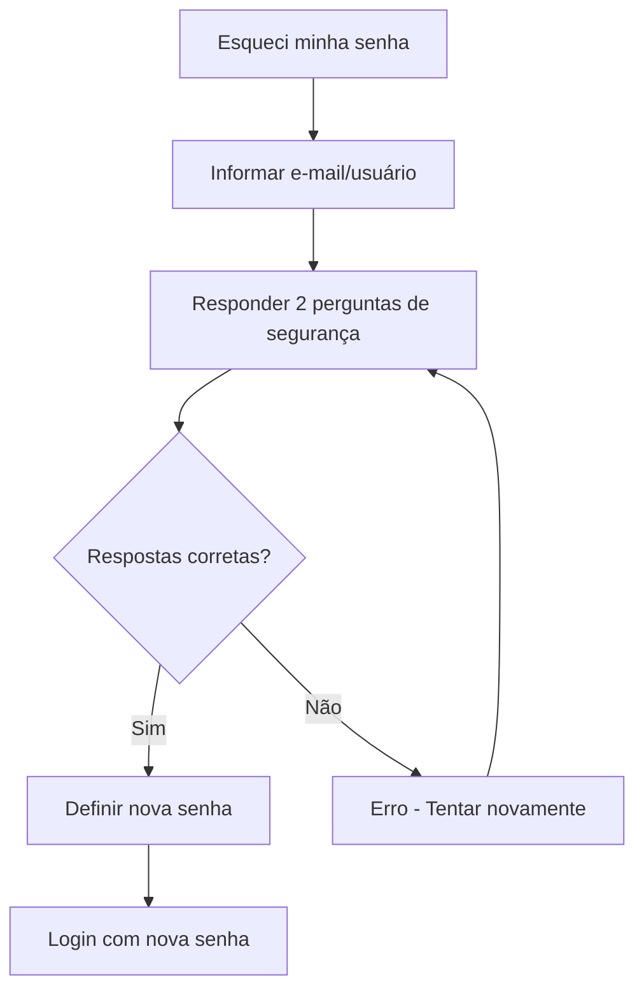

# 🚗 Sistema de Agendamento de Veículos

Sistema completo de gerenciamento de agendamentos de veículos desenvolvido com **Django 5.2** e **Python 3.12**, com controle de quilometragem, trajetos e sistema de aprovação.


## 📋 Sumário

- [🚀 Início Rápido](#-início-rápido)
  - [🐳 Com Docker (Recomendado)](#-com-docker-recomendado)
  - [⚡ Com Scripts de Automação](#-com-scripts-de-automação)
  - [🛠️ Instalação Manual](#%EF%B8%8F-instalação-manual)
- [🏗️ Arquitetura](#%EF%B8%8F-arquitetura)
- [✨ Funcionalidades](#-funcionalidades)
- [🛠️ Tecnologias](#%EF%B8%8F-tecnologias)
- [📦 Instalação](#-instalação)
- [🔧 Configuração Básica](#-configuração-básica)
- [🐳 Docker](#-docker)
- [⚡ Scripts de Automação](#-scripts-de-automação)
- [🏃‍♂️ Comandos Úteis](#%EF%B8%8F-comandos-úteis)
- [📖 Uso do Sistema](#-uso-do-sistema)
- [🔒 Sistema de Autenticação](#-sistema-de-autenticação)
- [📁 Estrutura do Projeto](#-estrutura-do-projeto)
- [🗄️ Modelos de Dados](#%EF%B8%8F-modelos-de-dados)
- [👤 Autor](#-autor)
- [🤝 Contribuição](#-contribuição)
- [📜 Licença](#-licença)

## 🚀 Início Rápido

### 🐳 Com Docker (Recomendado)

```bash
# Clone o projeto
git clone https://github.com/HeitorLouzeiro/agendamento_veiculos.git
cd agendamento_veiculos

# Configure as variáveis de ambiente
cp .env.example .env

# Setup completo com Docker
docker-setup.bat  # Windows
# ou
./docker-setup.sh  # Linux/Mac

# Iniciar aplicação
docker-compose up
```

**Ou manualmente com Docker:**
```bash
# Construir e iniciar serviços
docker-compose build
docker-compose up -d db
docker-compose run --rm web python manage.py migrate
docker-compose run --rm web python manage.py createsuperuser
docker-compose up
```

### ⚡ Com Scripts de Automação

```bash
# Clone o projeto
git clone https://github.com/HeitorLouzeiro/agendamento_veiculos.git
cd agendamento_veiculos

# Setup completo automatizado
./setup.sh

# Iniciar servidor
./start.sh
```

### 🛠️ Instalação Manual

```bash
# Clone e configure manualmente
git clone https://github.com/HeitorLouzeiro/agendamento_veiculos.git
cd agendamento_veiculos
python -m venv venv

# Windows
venv\Scripts\activate
# Linux/Mac
source venv/bin/activate

# Instale dependências e configure
pip install -r requirements.txt
python manage.py migrate
python manage.py createsuperuser
python manage.py runserver
```

✅ **Acesse a aplicação:**
- **Local/Scripts:** http://127.0.0.1:8000
- **Docker:** http://localhost:8000

> 💡 **Dica:** Docker oferece maior consistência entre ambientes. Para desenvolvimento local tradicional, use os scripts de automação. Veja [DOCKER.md](DOCKER.md) e [SCRIPTS.md](SCRIPTS.md) para detalhes.

## 🏗️ Arquitetura

O sistema segue a arquitetura **MVT (Model-View-Template)** do Django:

```
┌─────────────────────────────────────────────────────────────┐
│                    Cliente (Browser)                        │
└────────────────────────┬────────────────────────────────────┘
                         │ HTTP Request/Response
┌────────────────────────▼────────────────────────────────────┐
│                    Django Framework                         │
│  ┌──────────────┐  ┌──────────────┐  ┌──────────────┐     │
│  │   URLs       │─►│    Views     │◄►│   Templates  │     │
│  │  (Routers)   │  │ (Controllers)│  │    (HTML)    │     │
│  └──────────────┘  └──────┬───────┘  └──────────────┘     │
│                            │                                 │
│                    ┌───────▼────────┐                       │
│                    │     Models     │                       │
│                    │  (ORM Layer)   │                       │
│                    └───────┬────────┘                       │
└────────────────────────────┼────────────────────────────────┘
                             │
                    ┌────────▼────────┐
                    │ SQLite/PostgreSQL│
                    │    Database      │
                    └─────────────────┘
```

### Aplicações Django

- **usuarios** - Autenticação e gestão de usuários
- **cursos** - Cadastro e controle de cursos
- **veiculos** - Gestão de veículos
- **agendamentos** - Controle de agendamentos e trajetos
- **dashboard** - Painel principal do sistema

## ✨ Funcionalidades

### 👨‍🏫 Para Professores
- ✅ Criar solicitações de agendamento de veículos
- ✅ Visualizar histórico de agendamentos próprios
- ✅ Registrar trajetos realizados com quilometragem
- ✅ Editar perfil e alterar senha
- ✅ Recuperação de senha por perguntas de segurança
- ✅ Acompanhar status das solicitações

### 👔 Para Administradores
- ✅ Aprovar ou reprovar solicitações de agendamento
- ✅ Gerenciar cadastro de veículos (CRUD completo)
- ✅ Gerenciar cadastro de cursos (CRUD completo)
- ✅ Gerenciar usuários (professores e administradores)
- ✅ Visualizar todos os agendamentos do sistema
- ✅ Monitorar uso de quilometragem por curso
- ✅ Dashboard com estatísticas e visão geral
- ✅ Controle de limite de KM mensal por curso

### 🔧 Funcionalidades do Sistema
- ✅ Sistema de autenticação por e-mail ou username
- ✅ Validação automática de conflitos de horários
- ✅ Controle de limite de KM mensal por curso
- ✅ Histórico completo de trajetos e quilometragem
- ✅ Interface responsiva para desktop e mobile
- ✅ Notificações de status de agendamento
- ✅ Relatórios de uso de veículos
- ✅ Sistema de busca e filtros avançados

## 🛠️ Tecnologias

### Backend
- **Python** 3.12+ - Linguagem de programação
- **Django** 5.2.7 - Framework web
- **SQLite** - Banco de dados (desenvolvimento local)
- **PostgreSQL** 15 - Banco de dados (produção/Docker)
- **psycopg2-binary** - Adaptador PostgreSQL para Python
- **Django ORM** - Mapeamento objeto-relacional
- **Django Auth** - Sistema de autenticação

### Frontend
- **HTML5/CSS3** - Estrutura e estilo
- **JavaScript** - Interatividade no cliente
- **Bootstrap** 5 - Framework CSS responsivo
- **jQuery** - Biblioteca JavaScript

### Bibliotecas e Dependências
- **django-debug-toolbar** 6.0.0 - Ferramenta de debug
- **Pillow** 11.3.0 - Processamento de imagens
- **python-decouple** 3.8 - Gerenciamento de variáveis de ambiente
- **python-dotenv** 1.1.1 - Carregamento de variáveis .env
- **Faker** 37.8.0 - Geração de dados de teste
- **pytz** 2025.2 - Suporte a fusos horários
- **gunicorn** 23.0.0 - Servidor WSGI para produção
- **whitenoise** 6.11.0 - Servir arquivos estáticos em produção

### DevOps & Containerização
- **Docker** - Containerização da aplicação
- **Docker Compose** - Orquestração de containers
- **PostgreSQL** (Docker) - Banco de dados em container
- **WhiteNoise** - Servir arquivos estáticos em produção

## 📦 Instalação

### Pré-requisitos

#### Para Desenvolvimento Local
- **Python** 3.12 ou superior
- **pip** (gerenciador de pacotes Python)
- **Git** (para clonar o repositório)
- **Virtualenv** (recomendado)

#### Para Docker (Recomendado)
- **Docker** (20.10+)
- **Docker Compose** (2.0+)
- **Git** (para clonar o repositório)

### Verificação de Dependências

**Para desenvolvimento local:**
```bash
# Verificar Python
python --version

# Verificar pip
pip --version

# Verificar Git
git --version
```

**Para Docker:**
```bash
# Verificar Docker
docker --version

# Verificar Docker Compose
docker-compose --version

# Verificar Git
git --version
```

### Instalação Detalhada

#### Configuração do Ambiente Virtual

**Windows:**
```cmd
# CMD
venv\Scripts\activate

# PowerShell
venv\Scripts\Activate.ps1
```

**Linux/Mac:**
```bash
source venv/bin/activate
```

#### Dados de Exemplo (Opcional)

Execute o comando para criar dados de teste:

```bash
# Comando básico (valores padrão)
python manage.py load_sample_data

# Com parâmetros customizados
python manage.py load_sample_data --professores 15 --agendamentos 50 --administradores 5

# Para Docker
docker-compose run --rm web python manage.py load_sample_data --professores 10 --agendamentos 20
```

**Parâmetros disponíveis:**
- `--administradores` - Quantidade de administradores (padrão: 3)
- `--professores` - Quantidade de professores (padrão: 10) 
- `--agendamentos` - Quantidade de agendamentos (padrão: 30)

**O comando criará automaticamente:**
- 🔐 **Administradores** com credenciais de teste
- 👨‍🏫 **Professores** com perfis completos usando dados do Faker
- 📚 **5 cursos** diversos com limites de KM variados
- 🚗 **8 veículos** com diferentes características
- 📅 **Agendamentos** com status variados (pendente, aprovado, reprovado)
- 🗺️ **Trajetos** associados aos agendamentos aprovados
- ❓ **Perguntas de segurança** para recuperação de senha

### 👤 Usuários de Teste

Para facilitar o teste do sistema de recuperação de senha, aqui estão as credenciais e respostas de segurança dos usuários padrão:

#### **🔐 Administrador Principal**
| Campo | Valor |
|-------|-------|
| **E-mail** | `admin@sistema.com` |
| **Username** | `admin` |
| **Senha** | `admin123` |

**Perguntas de Segurança:**
| Pergunta | Resposta |
|----------|----------|
| Qual é o nome da sua mãe? | `Maria` |
| Qual é o nome do seu primeiro animal de estimação? | `Rex` |
| Em que cidade você nasceu? | `São Paulo` |

#### **👨‍🏫 Professor de Teste**
| Campo | Valor |
|-------|-------|
| **E-mail** | `professor@teste.com` |
| **Username** | `professor` |
| **Senha** | `prof123` |

**Perguntas de Segurança:**
| Pergunta | Resposta |
|----------|----------|
| Qual é o nome da sua escola primária? | `Santos Dumont` |
| Qual é seu filme favorito? | `Matrix` |
| Qual é sua comida favorita? | `Pizza` |

#### **🧪 Como Testar a Recuperação de Senha**

1. **Acesse:** `/usuarios/recuperar-senha/`
2. **Digite:** `admin@sistema.com` ou `admin`
3. **Responda:**
   - Nome da mãe: `Maria`
   - Nome do animal: `Rex` 
   - Cidade natal: `São Paulo`
4. **Defina uma nova senha** seguindo os critérios de segurança
5. **Faça login** com a nova senha

> ⚠️ **Atenção:** As respostas são **case-sensitive**. Digite exatamente como mostrado acima!

## � Configuração Básica

### 🌍 Variáveis de Ambiente

Para ambos os ambientes (local e Docker), você pode configurar:

```env
# Arquivo .env (opcional para desenvolvimento local, obrigatório para Docker)
DEBUG=True
SECRET_KEY=sua-chave-secreta-segura
ALLOWED_HOSTS=localhost,127.0.0.1

# Banco de dados (automático baseado no ambiente)
DB_ENGINE=sqlite3          # Para desenvolvimento local
# ou
DB_ENGINE=postgresql       # Para Docker/Produção

# Localização
LANGUAGE_CODE=pt-br
TIME_ZONE=America/Sao_Paulo
```

### ⚙️ Ambientes Suportados

| Componente | Desenvolvimento Local | Docker |
|------------|----------------------|---------|
| **Python** | Instalação local | Container |
| **Banco de Dados** | SQLite | PostgreSQL |
| **Servidor** | runserver | Gunicorn |
| **Configuração** | .env (opcional) | .env (obrigatório) |

## �🐳 Docker

O projeto oferece suporte completo ao Docker para facilitar o desenvolvimento e deploy. Com Docker, você não precisa instalar Python, PostgreSQL ou outras dependências localmente.

### 🚀 Configuração Rápida

```bash
# 1. Clone o repositório
git clone https://github.com/HeitorLouzeiro/agendamento_veiculos.git
cd agendamento_veiculos

# 2. Configure variáveis de ambiente
cp .env.example .env
# Edite o .env conforme necessário

# 3. Execute setup automático
docker-setup.bat  # Windows
# ou
./docker-setup.sh  # Linux/Mac
```

### 🎯 Comandos Docker Essenciais

```bash
# Construir imagens
docker-compose build

# Iniciar em modo desenvolvimento (com live reload)
docker-compose --profile dev up

# Iniciar em modo produção
docker-compose up

# Executar em background
docker-compose up -d

# Parar serviços
docker-compose down

# Ver logs
docker-compose logs -f web
```

### 🔧 Comandos de Desenvolvimento Django

```bash
# Migrações
docker-compose run --rm web python manage.py migrate
docker-compose run --rm web python manage.py makemigrations

# Administração
docker-compose run --rm web python manage.py createsuperuser
docker-compose run --rm web python manage.py collectstatic --noinput
docker-compose run --rm web python manage.py shell

# Dados de exemplo (com parâmetros customizáveis)
docker-compose run --rm web python manage.py load_sample_data
docker-compose run --rm web python manage.py load_sample_data --professores 20 --agendamentos 100 --administradores 5

# Testes e debug
docker-compose run --rm web python manage.py test
docker-compose logs -f web                 # Ver logs da aplicação
docker-compose logs -f db                  # Ver logs do banco
docker-compose exec web bash               # Acessar container web
docker-compose exec db psql -U postgres -d agendamento_veiculos  # Acessar PostgreSQL
```

### 📋 Serviços Docker

| Serviço | Descrição | Porta | Ambiente |
|---------|-----------|-------|----------|
| **web** | Aplicação Django (Gunicorn) | 8000 | Produção |
| **web-dev** | Aplicação Django (runserver) | 8000 | Desenvolvimento |
| **db** | PostgreSQL 15 | 5432 | Ambos |

### 🔒 Variáveis de Ambiente

O arquivo `.env.example` contém todas as configurações necessárias:

```bash
# Configurações básicas
DEBUG=True
SECRET_KEY=sua-chave-secreta
ALLOWED_HOSTS=localhost,127.0.0.1

# Banco de dados PostgreSQL
DB_ENGINE=postgresql
DB_NAME=agendamento_veiculos
DB_USER=postgres
DB_PASSWORD=postgres
DB_HOST=localhost  # 'db' no Docker
DB_PORT=5432

# Localização
LANGUAGE_CODE=pt-br
TIME_ZONE=America/Sao_Paulo
```

### 📊 Backup e Restore

```bash
# Backup do banco PostgreSQL
docker-compose exec db pg_dump -U postgres agendamento_veiculos > backup.sql

# Restore do banco
docker-compose exec -T db psql -U postgres agendamento_veiculos < backup.sql
```

### 🔍 Troubleshooting Docker

```bash
# Limpar containers e volumes
docker-compose down -v

# Reconstruir sem cache
docker-compose build --no-cache

# Ver status dos containers
docker-compose ps

# Acessar container em execução
docker-compose exec web bash
docker-compose exec db psql -U postgres -d agendamento_veiculos
```

> 📖 **Documentação Completa:** Veja [DOCKER.md](DOCKER.md) para guia detalhado de uso do Docker.

## ⚡ Scripts de Automação

O projeto inclui scripts shell para automatizar tarefas comuns de desenvolvimento:

### 🎯 Scripts Principais

```bash
# Setup inicial completo (execute uma vez)
./setup.sh

# Iniciar servidor com verificações completas
./start.sh

# Desenvolvimento rápido (minimalista)
./dev.sh

# Reset completo do banco de dados
./reset.sh
```

### 📋 Funcionalidades dos Scripts

| Script | Funcionalidade | Uso |
|--------|---------------|-----|
| **setup.sh** | Configuração inicial completa | Primeira vez ou nova máquina |
| **start.sh** | Servidor com verificações | Desenvolvimento diário |
| **dev.sh** | Servidor rápido | Quando precisa de velocidade |
| **reset.sh** | Reset do banco | Quando quer começar do zero |

### 🎨 Características

- ✅ **Interface colorida** e informativa
- ✅ **Verificações automáticas** de ambiente
- ✅ **Detecção de porta** disponível (8000-8005)
- ✅ **Criação automática** de venv se necessário
- ✅ **Tratamento de erros** robusto
- ✅ **Confirmações de segurança** para ações destrutivas

> 📖 **Documentação completa:** Veja [SCRIPTS.md](SCRIPTS.md) para detalhes e exemplos.

## 🏃‍♂️ Comandos Úteis

### 🖥️ Desenvolvimento Local

```bash
# Servidor de desenvolvimento
python manage.py runserver                  # Porta padrão (8000)
python manage.py runserver 8080            # Porta customizada
python manage.py runserver 0.0.0.0:8000    # Acessível na rede

# Migrações
python manage.py makemigrations             # Criar migrações
python manage.py migrate                    # Aplicar migrações

# Administração
python manage.py createsuperuser           # Criar administrador
python manage.py collectstatic             # Arquivos estáticos
python manage.py shell                     # Shell Django

# Dados de exemplo com parâmetros
python manage.py load_sample_data           # Valores padrão
python manage.py load_sample_data --professores 15 --agendamentos 50 --administradores 5

# Gerenciamento de usuários
python manage.py changepassword <username>  # Alterar senha de usuário
python manage.py list_users                 # Listar todos os usuários
```

### � Comandos Avançados

```bash
# Recuperação de senha (via shell - funciona tanto local quanto Docker)
python manage.py shell -c "
from usuarios.models import Usuario
user = Usuario.objects.get(email='admin@sistema.com')
user.set_password('nova_senha_123')
user.save()
print('Senha alterada com sucesso!')
"

# Verificar perguntas de segurança de um usuário
python manage.py shell -c "
from usuarios.models import Usuario
user = Usuario.objects.get(email='admin@sistema.com')
print(f'Pergunta 1: {user.pergunta_seguranca_1}')
print(f'Pergunta 2: {user.pergunta_seguranca_2}') 
print(f'Pergunta 3: {user.pergunta_seguranca_3}')
"
```

## 📖 Uso do Sistema

### Acessos

**Desenvolvimento Local:**
- 🌐 **Sistema Principal**: http://127.0.0.1:8000
- 🔐 **Login**: http://127.0.0.1:8000/login/
- 📊 **Dashboard**: http://127.0.0.1:8000/dashboard/
- ⚙️ **Admin Django**: http://127.0.0.1:8000/admin/

**Docker:**
- 🌐 **Sistema Principal**: http://localhost:8000
- 🔐 **Login**: http://localhost:8000/login/
- 📊 **Dashboard**: http://localhost:8000/dashboard/
- ⚙️ **Admin Django**: http://localhost:8000/admin/

### Credenciais de Teste

Com dados de exemplo carregados:

| Tipo | Username | Senha | Email |
|------|----------|-------|-------|
| Admin | admin | admin123 | admin@example.com |
| Admin | admin2 | admin123 | admin2@example.com |
| Professor | professor1 | prof123 | professor1@example.com |

### Fluxo de Trabalho

#### 👨‍🏫 Para Professores:

1. 🔐 **Login** no sistema
2. 📅 Acesse **"Agendamentos"** > **"Novo Agendamento"**
3. 📝 Preencha os dados:
   - Curso
   - Veículo
   - Data/hora de início
   - Data/hora de fim
4. ⏳ Aguarde a **aprovação** do administrador
5. ✅ Após aprovação, **registre os trajetos** realizados com quilometragem

#### 👔 Para Administradores:

1. 🔐 **Login** no sistema
2. 📋 Acesse **"Agendamentos"** para ver todas as solicitações
3. ✅ Clique em **"Aprovar"** ou ❌ **"Reprovar"** nas solicitações pendentes
4. 🚗 Gerencie **veículos** (adicionar, editar, inativar)
5. 📚 Gerencie **cursos** (adicionar, editar, configurar limites de KM)
6. 👥 Gerencie **usuários** (professores e administradores)
7. 📊 Monitore o **uso de quilometragem** por curso no dashboard

### Interface Admin Django

Acesse `/admin/` para usar a interface administrativa completa do Django com recursos avançados:
- Gestão completa de todos os modelos
- Filtros e buscas avançadas
- Edição em massa
- Histórico de alterações

## 🔒 Sistema de Autenticação

### Níveis de Acesso

| Tipo | Permissões |
|------|-----------|
| **Administrador** | Acesso total: gestão de usuários, aprovação de agendamentos, configurações |
| **Professor** | Criar agendamentos, registrar trajetos, visualizar próprios agendamentos |

### Características de Segurança

- ✅ Autenticação por **e-mail** ou **username**
- ✅ Backend customizado (`EmailOrUsernameBackend`)
- ✅ Recuperação de senha por **perguntas de segurança**
- ✅ Proteção CSRF e validação de senhas fortes
- ✅ Rotas protegidas por nível de acesso

### 🔐 Sistema de Recuperação de Senha

O sistema possui um processo seguro de recuperação de senha em **3 etapas** usando perguntas de segurança:

#### **Etapa 1: Identificação do Usuário**
- Informe seu **e-mail** ou **nome de usuário**
- Sistema verifica se o usuário existe

#### **Etapa 2: Perguntas de Segurança**
Responda **2 perguntas de segurança** cadastradas durante o registro:

| Pergunta | Exemplo de Resposta |
|----------|-------------------|
| **Qual é o nome da sua mãe?** | `Maria Silva` |
| **Qual é o nome do seu primeiro animal de estimação?** | `Rex` |
| **Em que cidade você nasceu?** | `São Paulo` |
| **Qual é o nome da sua escola primária?** | `Escola Santos Dumont` |
| **Qual é seu filme favorito?** | `Cidade de Deus` |
| **Qual é sua comida favorita?** | `Pizza` |
| **Qual é o nome do seu melhor amigo de infância?** | `João` |
| **Em que ano você se formou no ensino médio?** | `2015` |
| **Qual é o modelo do seu primeiro carro?** | `Civic` |
| **Qual é o nome da rua onde você cresceu?** | `Rua das Flores` |

#### **Etapa 3: Nova Senha**
- Após validar as respostas, defina sua **nova senha**
- A senha deve atender aos critérios de segurança

#### **🔒 Critérios de Senha Segura**
- ✅ Mínimo de **8 caracteres**
- ✅ Pelo menos **1 letra maiúscula**
- ✅ Pelo menos **1 letra minúscula**
- ✅ Pelo menos **1 número**
- ✅ Pelo menos **1 caractere especial** (@, #, $, %, etc.)

#### **⚠️ Importante**
- As respostas são **case-sensitive** (diferencia maiúsculas/minúsculas)
- Mantenha suas respostas **exatamente** como cadastradas
- Em caso de esquecimento, contate o administrador do sistema

### 🎯 Fluxo de Recuperação



### 🧪 Usuários de Teste

Para testar o sistema de recuperação de senha, use estes usuários pré-configurados:

#### **Admin Principal**
- **E-mail:** `admin@sistema.com`
- **Username:** `admin`
- **Senha:** `admin123`
- **Perguntas de Segurança:**
  - *Qual é o nome da sua mãe?* → `Maria`
  - *Qual é o nome do seu primeiro animal de estimação?* → `Rex`

#### **Professor de Teste**
- **E-mail:** `professor@teste.com`
- **Username:** `professor`
- **Senha:** `prof123`
- **Perguntas de Segurança:**
  - *Em que cidade você nasceu?* → `São Paulo`
  - *Qual é sua comida favorita?* → `Pizza`

### 🔧 Comandos de Gerenciamento de Senha

```bash
# Alterar senha via Django Admin
python manage.py changepassword admin

# Criar superusuário
python manage.py createsuperuser

# Shell interativo para manipular usuários
python manage.py shell
```

**Exemplo no shell:**
```python
from usuarios.models import Usuario

# Encontrar usuário
user = Usuario.objects.get(email='admin@sistema.com')

# Alterar respostas de segurança
user.resposta_seguranca_1 = 'Nova Resposta'
user.resposta_seguranca_2 = 'Outra Resposta'
user.save()

# Verificar respostas
print(f"Pergunta 1: {user.pergunta_seguranca_1}")
print(f"Resposta 1: {user.resposta_seguranca_1}")
```

## 📁 Estrutura do Projeto

```
agendamento_veiculos/
├── 📁 agendamento_veiculos/      # Configurações do projeto Django
│   ├── 📄 __init__.py
│   ├── 📄 settings.py            # Configurações principais
│   ├── 📄 urls.py                # URLs raiz do projeto
│   ├── 📄 wsgi.py                # Configuração WSGI
│   └── 📄 asgi.py                # Configuração ASGI
│
├── 📁 usuarios/                  # App de usuários
│   ├── 📄 models.py              # Model Usuario (AbstractUser customizado)
│   ├── 📄 views.py               # Views de autenticação e perfil
│   ├── 📄 forms.py               # Formulários de usuário
│   ├── 📄 backends.py            # Backend de autenticação customizado
│   ├── 📄 urls.py                # URLs do app
│   ├── 📄 admin.py               # Configuração do admin
│   └── 📁 migrations/            # Migrações do banco
│
├── 📁 cursos/                    # App de cursos
│   ├── 📄 models.py              # Model Curso
│   ├── 📄 views.py               # CRUD de cursos
│   ├── 📄 forms.py               # Formulários de curso
│   ├── 📄 urls.py                # URLs do app
│   ├── 📄 admin.py               # Configuração do admin
│   └── 📁 migrations/            # Migrações do banco
│
├── 📁 veiculos/                  # App de veículos
│   ├── 📄 models.py              # Model Veiculo
│   ├── 📄 views.py               # CRUD de veículos
│   ├── 📄 forms.py               # Formulários de veículo
│   ├── 📄 urls.py                # URLs do app
│   ├── 📄 admin.py               # Configuração do admin
│   └── 📁 migrations/            # Migrações do banco
│
├── 📁 agendamentos/              # App de agendamentos
│   ├── 📄 models.py              # Models: Agendamento, Trajeto
│   ├── 📄 views.py               # Views de agendamento e trajeto
│   ├── 📄 forms.py               # Formulários de agendamento
│   ├── 📄 urls.py                # URLs do app
│   ├── 📄 admin.py               # Configuração do admin
│   └── 📁 migrations/            # Migrações do banco
│
├── 📁 dashboard/                 # App do dashboard
│   ├── 📄 models.py              # (sem models específicos)
│   ├── 📄 views.py               # View do dashboard principal
│   ├── 📄 urls.py                # URLs do app
│   └── 📁 migrations/            # Migrações do banco
│
├── 📁 templates/                 # Templates HTML
│   ├── 📄 base.html              # Template base
│   ├── 📁 usuarios/              # Templates de autenticação
│   │   ├── 📄 login.html
│   │   ├── 📄 registro.html
│   │   ├── 📄 editar_perfil.html
│   │   └── 📄 alterar_senha.html
│   ├── 📁 cursos/                # Templates de cursos
│   │   ├── 📄 lista.html
│   │   ├── 📄 form.html
│   │   └── 📄 deletar.html
│   ├── 📁 veiculos/              # Templates de veículos
│   │   ├── 📄 lista.html
│   │   ├── 📄 form.html
│   │   └── 📄 deletar.html
│   ├── 📁 agendamentos/          # Templates de agendamentos
│   │   ├── 📄 lista.html
│   │   ├── 📄 form.html
│   │   ├── 📄 detalhe.html
│   │   ├── 📄 aprovacao.html
│   │   └── 📄 reprovar.html
│   └── 📁 dashboard/             # Templates do dashboard
│       └── 📄 index.html
│
├── 📄 manage.py                  # Script de gerenciamento Django
├── 📄 requirements.txt           # Dependências do projeto
├── 📄 db.sqlite3                 # Banco de dados SQLite (desenvolvimento local)
├── 📁 static/                    # Arquivos estáticos (CSS, JS, imagens)
├── 📁 staticfiles/               # Arquivos estáticos coletados (produção/Docker)
│
├── 🐳 **Arquivos Docker**
├── 📄 Dockerfile                 # Configuração da imagem Docker
├── 📄 docker-compose.yml         # Orquestração dos serviços
├── 📄 .dockerignore              # Arquivos ignorados pelo Docker
├── 📄 docker-setup.sh            # Script de configuração (Linux/Mac)
├── 📄 docker-setup.bat           # Script de configuração (Windows)
│
├── 🔧 **Configuração e Documentação**
├── 📄 .env.example               # Exemplo de variáveis de ambiente
├── 📄 .gitignore                 # Arquivos ignorados pelo Git
├── 📄 DOCKER.md                  # Documentação específica do Docker
├── 📄 SCRIPTS.md                 # Documentação dos scripts de automação
└── 📄 README.md                  # Documentação principal do projeto
```

### 🔄 Ambientes de Execução

O projeto suporta diferentes ambientes com configurações automatizadas:

| Componente | Desenvolvimento Local | Docker |
|------------|----------------------|---------|
| **Python** | Instalação local | Container |
| **Banco de Dados** | SQLite | PostgreSQL |
| **Servidor** | runserver | Gunicorn |
| **Arquivos Estáticos** | Desenvolvimento | WhiteNoise |
| **Variáveis de Ambiente** | .env (opcional) | .env (obrigatório) |
| **Porta de Acesso** | 127.0.0.1:8000 | localhost:8000 |

## 🗄️ Modelos de Dados

### 👤 Usuario (AbstractUser customizado)

```python
class Usuario(AbstractUser):
    tipo_usuario        # 'professor' ou 'administrador'
    email               # E-mail único (obrigatório)
    telefone            # Telefone de contato
    pergunta_seguranca_1  # Primeira pergunta de segurança
    resposta_seguranca_1  # Resposta da primeira pergunta
    pergunta_seguranca_2  # Segunda pergunta de segurança
    resposta_seguranca_2  # Resposta da segunda pergunta
    # + Campos do Django User (username, password, first_name, etc.)
```

### 📚 Curso

```python
class Curso(models.Model):
    id = UUIDField         # ID único (UUID)
    nome                   # Nome do curso (único)
    limite_km_mensal       # Limite de quilometragem mensal
    descricao              # Descrição do curso
    ativo                  # Status do curso (ativo/inativo)
    criado_em              # Data de criação
    atualizado_em          # Data da última atualização
```

**Métodos:**
- `get_km_utilizados_mes(ano, mes)` - Retorna KM utilizados no mês
- `tem_limite_disponivel(km_adicional, ano, mes)` - Verifica disponibilidade de KM

### 🚗 Veiculo

```python
class Veiculo(models.Model):
    id = UUIDField              # ID único (UUID)
    placa                       # Placa do veículo (única)
    modelo                      # Modelo do veículo
    marca                       # Marca do veículo
    ano                         # Ano de fabricação
    cor                         # Cor do veículo
    capacidade_passageiros      # Capacidade de passageiros
    observacoes                 # Observações adicionais
    ativo                       # Status do veículo (ativo/inativo)
    criado_em                   # Data de criação
    atualizado_em               # Data da última atualização
```

**Métodos:**
- `tem_conflito(data_inicio, data_fim, agendamento_id)` - Verifica conflitos de horário

### 📅 Agendamento

```python
class Agendamento(models.Model):
    id = UUIDField           # ID único (UUID)
    curso                    # ForeignKey para Curso
    professor                # ForeignKey para Usuario
    veiculo                  # ForeignKey para Veiculo
    data_inicio              # Data/hora de início
    data_fim                 # Data/hora de fim
    status                   # 'pendente', 'aprovado' ou 'reprovado'
    motivo_reprovacao        # Motivo da reprovação (opcional)
    aprovador                # ForeignKey para Usuario (quem aprovou)
    data_aprovacao           # Data da aprovação/reprovação
    criado_em                # Data de criação
    atualizado_em            # Data da última atualização
```

**Métodos:**
- `aprovar(aprovador)` - Aprova o agendamento
- `reprovar(aprovador, motivo)` - Reprova o agendamento
- `get_km_total()` - Retorna quilometragem total dos trajetos

### 🗺️ Trajeto

```python
class Trajeto(models.Model):
    id = UUIDField           # ID único (UUID)
    agendamento              # ForeignKey para Agendamento
    km_inicial               # Quilometragem inicial
    km_final                 # Quilometragem final
    descricao                # Descrição do trajeto
    data_registro            # Data de registro
    criado_em                # Data de criação
```

**Propriedades:**
- `km_percorridos` - Calcula a diferença entre KM final e inicial

## 👤 Autor

**Heitor Louzeiro** - *Desenvolvedor Principal*
- GitHub: [@HeitorLouzeiro](https://github.com/HeitorLouzeiro)
- LinkedIn: [Heitor Louzeiro](https://www.linkedin.com/in/heitor-louzeiro/)

## 🤝 Contribuição

1. **Fork** o projeto
2. Crie uma **branch** para sua feature (`git checkout -b feature/NovaFuncionalidade`)
3. **Commit** suas mudanças (`git commit -m 'Adiciona NovaFuncionalidade'`)
4. **Push** para a branch (`git push origin feature/NovaFuncionalidade`)
5. Abra um **Pull Request**

### Diretrizes de Contribuição

- ✅ Siga a **PEP 8** para código Python
- ✅ Use **nomes descritivos** para variáveis e funções
- ✅ Adicione **docstrings** para classes e funções
- ✅ Escreva **testes** para novas funcionalidades
- ✅ Atualize a **documentação** quando necessário
- ✅ Use **commits semânticos**

### Commits Semânticos

```
feat: Nova funcionalidade
fix: Correção de bug
docs: Alteração na documentação
style: Formatação de código
refactor: Refatoração de código
test: Adição ou correção de testes
chore: Tarefas de manutenção
```

## 📜 Licença

Este projeto está licenciado sob a Apache License - veja o arquivo [LICENSE](LICENSE) para detalhes.

---

<div align="center">

🚗 **Sistema de Agendamento de Veículos** 🚗

*Desenvolvido com Django - Controle total dos seus agendamentos*

</div>
